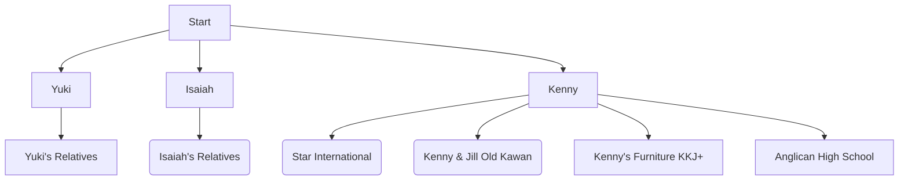

```mermaid
graph TD;
S["Start"]-->Y["Yuki"]
S-->Z["Isaiah"]
S-->K["Kenny"]
Y-->YR["Yuki's Relatives"]
Z-->ZR("Isaiah's Relatives")
K-->SI("Star International")
K-->OK("Kenny & Jill Old Kawan")
K-->F["Kenny's Furniture KKJ+"]
K-->AHS["Anglican High School"]
```